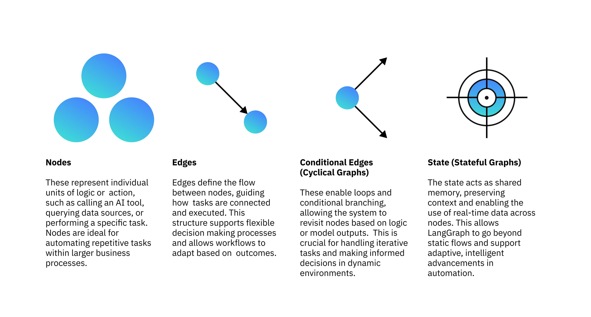

## 导读

Agentic AI 本质上是一种 [AI 系统](https://www.oracle.com/cn/artificial-intelligence/what-is-ai/)，它能够自主地基于历史情况和对当前需求的评估结果来制定决策，尽可能减少人为监督的需要。一个 Agentic AI 系统可以审查一项目标的当前实现进度和状态，然后制定适当决策，例如增设新步骤或寻求人类/其他 AI 系统的帮助。

与常见于非生成式 AI 服务的传统 AI 不同，Agentic AI 不局限于人为审查和监督下的某一输入/输出模型。它具有足够的自主性，可以为实现特定目标而自主采取复杂步骤，仅在必要时才需要人类介入。

我们可以将 Agentic AI 想象成一名经理而不是一名技术人员。专用 AI agent 旨在基于外部输入执行被设定的工作，就像一名熟练的技术人员执行被分配的任务一样。Agentic AI 则可以自主决策，按需使用多种 AI 技术（包括[生成式 AI](https://www.oracle.com/cn/artificial-intelligence/generative-ai/)），就像一名经理判断由哪些技术人员来完成一个项目一样。在这个类比中，Agentic AI 这名经理可以与同事协作，收集现场服务技术人员的反馈意见，优化工作流，征询更多信息，并在需要时部署更多资源。

**关键要点**

- Agentic AI 指的是能够自主决策如何实现目标，并基于这些决策采取行动的 AI 系统。

- Agentic AI 系统可以与 AI agent 和人类合作来设定工作目标并予以实现。

- Agentic AI 系统通常使用多种工具（包括 AI 模型、专用 AI agent 和精心编排的 AI 服务）来实现战略性目标。

- Agentic AI 系统相比传统 AI 可以执行更复杂、更独立的操作，但其对资源的需求也显著大于传统 AI。

## AI Agent vs. Agentic AI 系统

AI Agent 是“单个智能体”，重点在于一个模型如何感知、推理、规划和执行任务；它通常围绕一个主体完成决策与行动，比如一个会调用工具、具备记忆和反思能力的代码助手或时间序列预测助手。

Agentic AI System 则是“智能体系统”，重点不再是单个 Agent 本身，而是多个 Agent、工具、记忆模块、工作流与环境之间的协同自治。它强调系统级自主性，包括任务拆解、多阶段规划、长期运行、反馈优化以及多 Agent 协作，更像一个完整的 AI 自动化生态。

简单说：

- AI Agent：一个会做事的智能体

- Agentic AI System：一整套由智能体驱动的自治系统

前者关注“个体能力”，后者关注“系统协同与自治能力”。

**对于企业而言，问题已不在于 Agentic AI 能做什么，而在于从何处入手。既支持轻松集成和自定义，又具有可扩展性的预构建 Agentic AI 平台堪称一个理想选择。**

  

## Agentic AI 工作原理

Agentic AI 系统旨在用于管理和运行各种 AI 元素，实现特定项目目标。不同的项目在目标上可能略有不同，但 Agentic AI 系统大体上都遵循以下步骤：

1. **建立目标和参数：**接收由人类用户输入的项目目标和项目约束条件。
2. **项目任务和步骤：**使用适当的 LLM（或许是系统预构建的一个基础模型）处理项目信息，基于项目参数和约束条件来创建一个可实现项目目标的任务“链”。
3. **自主决策：**基于所确立的工作任务，Agentic AI 系统判断如何实现目标，然后自主或（必要时）在人为干预下执行。
4. **反馈和修正：**AI agent 收集来自并行任务的数据，在需要时调整工作流。这包括从削减步骤（以优化工作流）到增设新步骤（以进一步收集数据）的所有可能措施。Agentic AI 系统真正引人注目的一点正是它能够基于实时数据制定决策和做出调整。
5. **系统性改进：**在实现目标的过程中，AI agent 会将所记录的结果和操作输入一个系统性反馈循环 — 这在 AI 领域常被称为“数据飞轮”。这一反馈循环将逐渐提高 AI agent 的准确性和效率，拓展 AI agent 的边界。

Agentic AI 的工作原理本质上是一个“目标驱动的自主闭环系统”。系统首先接收人类给出的目标和约束条件，然后利用大语言模型对任务进行分析与拆解，生成可执行的任务链和工作步骤。随后，AI agent 会自主决定如何完成这些任务，包括选择工具、调用模型、调整执行顺序以及与外部环境交互。

在执行过程中，系统会持续接收实时反馈，并根据结果动态调整策略，例如删除低效步骤、增加新的分析流程或重新选择执行方案。整个系统不是固定流程，而是能够边运行边优化的动态工作流。

与此同时，Agentic AI 还会记录历史执行结果、错误和成功经验，并通过持续反馈循环不断优化后续决策能力。这种“**执行—反馈—修正—再执行**”的机制，使系统能够逐渐提升准确性、效率与自治能力。

  

## Agentic Workflow

### 什么是 Agentic Workflow？

Agentic workflow 是一种由 AI agent 自主驱动的任务执行流程，其核心目标是让 AI 能够围绕某个目标持续规划、拆解、执行和协作，而不是仅进行单轮回答。

当系统接收到目标后，主 agent 会先将复杂任务拆分为多个较小步骤，然后通过创建多个子 agent 形成多智能体系统（Multi-Agent System, MAS）。其中，主 agent（也称 orchestrator、meta agent 或 supervisor）负责整体协调，包括任务分配、执行监督、结果汇总以及流程调整；其他 agent 则分别负责不同子任务，并行执行工作。

整个 workflow 中，各 agent 会不断与共享记忆模块交互，通过反馈循环同步上下文、历史经验、知识状态和当前任务信息，从而实现协同决策与动态优化。系统能够根据执行结果实时调整策略，例如重新分配任务、增加步骤或修正错误。

因此，Agentic workflow 本质上是一种“多智能体自治协作工作流”，强调任务拆解、并行执行、共享记忆、反馈优化以及持续自主运行。

  

### Agentic Workflow 的组成

Agentic Workflow 的核心，是让 AI agent 能够**围绕目标进行自主规划、工具调用、协同执行和动态优化**，而不仅仅是生成文本回复。其组成部分主要包括以下几个方面：

- AI Agent 是整个系统的主体，负责感知任务、规划流程、调用工具并执行决策；如果没有具备自主能力的 agent，工作流就只是普通自动化流程，而不是“agentic”。

- 大型语言模型（LLM）是 agent 的推理核心，用于理解自然语言、生成计划、分析问题和进行决策。LLM 的能力与参数设置会直接影响 agent 的表现和输出质量。

- 工具（Tools）用于扩展 LLM 的能力边界。由于 LLM 本身无法实时获取外部信息，因此 agent 需要通过 API、数据库、搜索引擎或外部模型获取数据并执行操作。现代 agent 往往本质上是“LLM + 工具调度系统”。

- 反馈机制（Feedback Loop）用于帮助 agent 持续修正决策，包括人类反馈（HITL）、环境反馈或其他 agent 的反馈。系统会依据执行结果动态调整后续行为，从而形成闭环优化。

- 提示工程（Prompt Engineering）决定了 agent 的推理质量和行为模式。常见技术包括思维链（CoT）、Few-shot、Zero-shot、自我反思（Reflection）等，它们帮助 agent 更稳定地完成复杂任务。

- 多智能体协作（Multi-Agent System, MAS）则让多个 agent 分工合作。不同 agent 可以拥有不同工具、知识或专业能力，通过共享记忆与通信机制并行解决复杂问题，从而提高系统效率和可扩展性。

- 集成（Integration）负责让 agent workflow 接入真实业务环境，包括数据库、企业系统、云平台以及 agent 框架（如LangChain、LangGraph、CrewAI）。这一部分决定了 agent 能否真正落地到生产环境中。

Agentic Workflow 的真正价值，在于它具备动态适应能力。系统不仅能完成既定任务，还能在工具失效、环境变化或任务中断时自主调整策略。例如，当某个搜索 API 不可用时，agent 可以自动切换到其他工具继续执行任务。这种能力使 AI 从“被动回答系统”逐渐演化为“主动自治系统”。

同时，Agentic Workflow 还能够持续生成高质量交互数据，并通过反馈循环不断优化模型和系统本身，因此它不仅是任务执行框架，也被认为是未来训练和增强 LLM 的重要方向。

  

## 如何搭建 Agentic Workflow？

Agentic 框架的价值在于它能够抽象掉开发者通常不愿处理的复杂性：

- **[状态管理](https://www.itsolotime.com/archives/tag/%e7%8a%b6%e6%80%81%e7%ae%a1%e7%90%86)**：不仅管理对话历史，还包括在执行 RAG 等任务时收集的所有相关信息。

- **工具使用**：开发者无需编写调用工具的具体逻辑，只需定义好工具，框架便能负责如何调用，尤其擅长处理并行与异步的工具调用。

因此，使用 Agentic 框架可以剥离大量底层细节，让开发者能够将精力集中于产品的核心逻辑。

现在流行的agent框架很多，包括LangGraph、LangChain、CrewAI、DSPy、Microsoft AutoGen等。下面将从中选取几个我认为最值得了解学习的框架进行介绍。

## LangGraph + LLM 构建Agentic Workflow

工作流中的每个步骤（称为“节点”）都由一个智能体处理，这些智能体通常由[大型语言模型](https://www.ibm.com/think/topics/large-language-models)驱动。这些智能体根据模型输出或条件逻辑在不同状态之间转换，从而形成一个动态的、决策驱动的图。

### 理解LangGraph

LangGraph 由LangChain创建，是一个开源的 AI 代理框架，旨在构建、部署和管理复杂的生成式 AI 代理工作流程。它提供了一系列工具和库，使用户能够以可扩展且高效的方式创建、运行和优化[大型语言模型](https://www.ibm.com/think/topics/large-language-models)(LLM)。LangGraph 的核心在于利用基于图的架构来建模和管理Agentic Workflow中各个组件之间错综复杂的关系。

使用 LangGraph，可以：

- 将每个智能体的行为定义为一个独立的节点。

- 使用算法或模型输出来确定下一步

- 在节点之间传递状态以保存内存和上下文

- 轻松可视化、调试和控制推理流程

LangGraph 引入了一种现代化的AI技术编排方法，它将复杂的流程分解为模块化的智能组件。与传统的自动化或机器人流程自动化 (RPA) 不同，LangGraph 利用实时逻辑和内存，实现了动态的、上下文感知的任务执行。核心思想是基于“图”来构建工作流。在每次处理请求时，系统都会执行这个图。以下是该框架的四个关键组件：

- 节点：节点代表独立的逻辑或操作单元，例如调用人工智能工具、查询数据源或执行特定任务。它们非常适合在大型[业务流程](https://www.ibm.com/think/topics/artificial-intelligence-business)中自动化重复性任务。

- 边：边定义了节点之间的流程，指导任务的连接和执行方式。这种结构支持灵活的决策过程，并允许工作流程根据结果进行调整。

- 条件边（循环图）：循环图支持循环和条件分支，允许系统根据逻辑或模型输出重新访问节点。这种能力对于处理迭代任务和在动态环境中做出明智的决策至关重要。

- 状态（有状态图）：状态充当共享内存，保留上下文并支持跨节点使用实时数据。这种能力使 LangGraph 能够超越静态流程，支持[工作流自动化](https://www.ibm.com/think/topics/workflow-automation)的自适应、智能化发展。

这些组件共同作用，使 LangGraph 能够改变组织设计和执行 AI 驱动的工作流程的方式，从而弥合 AI 工具与现实世界业务流程之间的差距。



### 实践经验

#### 步骤一： 准备环境与模型

先解决 Python 环境 + LLM 调用方式

模型来源可以是：

|类型|示例|
|---|---|
|本地模型|Qwen / Granite / Llama|
|API 模型|DeepSeek / GPT / Claude|
|推理服务|vLLM / Ollama / TGI|

#### 步骤二： 安装依赖

LangGraph 必备：

```powershell
pip install langgraph
```

常见组合：

```powershell
pip install langgraph openai langchain-core python-dotenv
```

如果本地推理：

```powershell
pip install transformers accelerate torch
```

- `transformers:`  这是用于加载和操作预训练语言模型的主要库

- `accelerate:` 有助于高效加载模型和放置设备，尤其适用于无缝使用 GPU。

 `-q` 该标志会静默运行安装程序，抑制详细输出，从而提供更简洁的笔记本界面。这些库对于下载模型和高效地处理本教程中的推理至关重要。

`!pip install -q transformers accelerate`

  

#### 步骤三： 定义状态（最重要）

Agent 的核心不是 Prompt，而是State。

例如：

```python
class AgentState(TypedDict):
    query: str
    plan: str
    draft: str
    critique: str
    retry_count: int
    final_answer: str
```

State 的作用：

- 保存上下文

- 保存中间结果

- 让节点解耦

- 支持循环与修复

这是结构化推理，而不是promot拼接

  

#### 步骤四： 同一封装LLM接口

**注意：所有节点都不要直接调 API**

而是统一使用封装的LLM接口

```python
def invoke_llm(prompt):
```

例如：

```
generate_with_granite(prompt)
```

```
build_chat_invoker(messages)
```

好处：

- 统一 temperature

- 统一 system prompt

- 统一模型切换

- 统一日志

- 后续可替换模型

这是推理层抽象。

  

#### 步骤五： 设计节点

每个 Node 都遵循统一模式：

```python
def node(state):
    # 1. 读取状态
    ...

    # 2. 构造 prompt
    ...

    # 3. 调用 LLM / Tool
    ...

    # 4. 写回状态
    return updated_state
```

节点就是 当前状态 → 新状态

例如：

|节点|功能|
|---|---|
|Planner|拆任务|
|Research|搜索资料|
|Critic|判断质量|
|Rewrite|修复结果|
|Finalize|输出结果|

  

#### 步骤六： 加入可观测性

例如：

- 日志

- 时间统计

- Retry 次数

- Token 消耗

```python
with_progress()
```

本质是 Agent Runtime Monitoring，否则复杂 Flow 很难调试。

  

#### 步骤七： 构建Graph

（1）注册节点

```
graph.add_node(...)
```

（2）添加线性边

```
graph.add_edge(A,B)
```

代表固定流程

（3）添加条件边（Agent 核心）

```python
graph.add_conditional_edges(
    "critic",
    route_fn,
    {
        "rewrite": "rewrite",
        "finalize": "final"
    }
)
```

route_fn 根据 state 决定下一步去哪

示例代码如下：

```python
# Define LangGraph


graph = StateGraph(dict)

graph.add_node("select_genre", with_progress(select_genre_node, "Select Genre", 1, 4))

graph.add_node("generate_outline", with_progress(generate_outline_node, "Generate Outline", 2, 4))

graph.add_node("generate_scene", with_progress(generate_scene_node, "Generate Scene", 3, 4))

graph.add_node("write_dialogue", with_progress(write_dialogue_node, "Write Dialogue", 4, 4))


graph.set_entry_point("select_genre")

graph.add_edge("select_genre", "generate_outline")

graph.add_edge("generate_outline", "generate_scene")

graph.add_edge("generate_scene", "write_dialogue")

graph.set_finish_point("write_dialogue")


workflow = graph.compile()
```

  

#### 步骤八： **运行 LangGraph 工作流并显示输出**

```python
# Run workflow

initial_state = {

    "user_input": "I want to write a whimsical fantasy story for children about a lost dragon finding its home."

}

final_state = workflow.invoke(initial_state)


# Display Results

print("\n=== Final Output ===")

print("Genre:", final_state.get("genre"))

print("Tone:", final_state.get("tone"))

print("\nPlot Outline:\n", final_state.get("outline"))

print("\nKey Scene:\n", final_state.get("scene"))

print("\nDialogue:\n", final_state.get("dialogue"))
```

最后运行**完整的创意工作流程**，并显示每个阶段的结果。

`initial_state:` 此命令是工作流程的起点，用户输入的内容将作为流程的种子。

`final_state:` 此命令会触发完整的 LangGraph 流水线。输入数据会按顺序依次经过每个已注册的节点。

  

### 核心思想

#### （1）State First

真正的 Agent不是 Prompt 驱动，而是 State 驱动

状态才是：

- memory

- reasoning trace

- retry context

- planning result

的载体。

#### （2）Code Controls Flow

工业级 Agent 一般LLM 负责推理，代码负责控制流

而不是让 LLM 自己决定所有事情

因此：

- Route 用代码写

- Retry 用代码控

- Loop 上限代码限制

更稳定。

#### （3）Loop 才是真 Agent

没有 Loop只是 Workflow

有：

- Reflection

- Retry

- Self-correction

- Critic

- Replanning

后才是真正 Agentic System

  

### 案例讲解

首先，加载必要的库并初始化 LLM。本例中使用 AWS Bedrock 的 Claude 模型，你也可以替换为其他服务商。

```python
from typing_extensions import TypedDict, Literal
from langgraph.checkpoint.memory import InMemorySaver
from langgraph.graph import StateGraph, START, END
from langgraph.types import Command, interrupt
from langchain_aws import ChatBedrockConverse
from langchain_core.messages import HumanMessage, SystemMessage
from pydantic import BaseModel, Field
from IPython.display import display, Image
from dotenv import load_dotenv
import os
load_dotenv()

aws_access_key_id = os.getenv("AWS_ACCESS_KEY_ID") or ""
aws_secret_access_key = os.getenv("AWS_SECRET_ACCESS_KEY") or ""

os.environ["AWS_ACCESS_KEY_ID"] = aws_access_key_id
os.environ["AWS_SECRET_ACCESS_KEY"] = aws_secret_access_key

llm = ChatBedrockConverse(
    model_id="us.anthropic.claude-3-5-haiku-20241022-v1:0",
    region_name="us-east-1",
    aws_access_key_id=aws_access_key_id,
    aws_secret_access_key=aws_secret_access_key,
)

# 使用字典模拟文档数据库，生产环境应替换为真实数据库
document_database: dict[str, str] = {}
```

接下来定义图。首先创建一个路由器，用于将用户输入分类为三种意图

```python
# 定义状态结构
class State(TypedDict):
    input: str
    decision: str | None
    output: str | None

# 为路由逻辑定义结构化输出模式
class Route(BaseModel):
    step: Literal["add_document", "delete_document", "ask_document"] = Field(
        description="路由流程中的下一步"
    )

# 增强 LLM，使其支持结构化输出以用于路由
router = llm.with_structured_output(Route)

def llm_call_router(state: State):
    """将用户输入路由到适当的节点"""
    decision = router.invoke(
        [
            SystemMessage(
                content="""将用户输入路由到以下三种意图之一：
                - 'add_document'
                - 'delete_document'
                - 'ask_document'
                你只需返回意图，无需其他文本。
                """
            ),
            HumanMessage(content=state["input"]),
        ]
    )
    return {"decision": decision.step}

# 条件边函数，根据决策路由到对应节点
def route_decision(state: State):
    if state["decision"] == "add_document":
        return "add_document_to_database_tool"
    elif state["decision"] == "delete_document":
        return "delete_document_from_database_tool"
    elif state["decision"] == "ask_document":
        return "ask_document_tool"
```

这里定义了状态 `State` 来存储用户输入和路由决策。通过强制 LLM 进行结构化输出，我们确保了模型只会返回三种预定义的意图之一，从而实现了可靠的路由逻辑。

接着，我们定义本例中使用的三个工具，每个意图对应一个工具。

```python
# 节点定义
def add_document_to_database_tool(state: State):
    """向数据库添加文档。根据用户查询，提取文档的文件名和内容。若未提供，则不添加。"""
    user_query = state["input"]
    # 从用户查询中提取文件名
    filename_prompt = f"根据以下用户查询，提取文档的文件名：{user_query}。只返回文件名，不要返回其他文本。"
    output = llm.invoke(filename_prompt)
    filename = output.content
    # 从用户查询中提取内容
    content_prompt = f"根据以下用户查询，提取文档的内容：{user_query}。只返回内容，不要返回其他文本。"
    output = llm.invoke(content_prompt)
    content = output.content
    # 将文档添加到数据库
    document_database[filename] = content
    return {"output": f"文档 {filename} 已添加到数据库"}

def delete_document_from_database_tool(state: State):
    """从数据库删除文档。根据用户查询，提取要删除的文档的文件名。若未提供，则不删除。"""
    user_query = state["input"]
    # 从用户查询中提取文件名
    filename_prompt = f"根据以下用户查询，提取要删除的文档的文件名：{user_query}。只返回文件名，不要返回其他文本。"
    output = llm.invoke(filename_prompt)
    filename = output.content
    # 如果文档存在则删除，否则返回失败信息
    if filename not in document_database:
        return {"output": f"数据库中未找到文档 {filename}"}
    document_database.pop(filename)
    return {"output": f"文档 {filename} 已从数据库删除"}

def ask_document_tool(state: State):
    """询问文档相关问题。根据用户查询，提取文档的文件名和问题。若未提供，则不提问。"""
    user_query = state["input"]
    # 从用户查询中提取文件名
    filename_prompt = f"根据以下用户查询，提取要提问的文档的文件名：{user_query}。只返回文件名，不要返回其他文本。"
    output = llm.invoke(filename_prompt)
    filename = output.content
    # 从用户查询中提取问题
    question_prompt = f"根据以下用户查询，提取要问文档的问题：{user_query}。只返回问题，不要返回其他文本。"
    output = llm.invoke(question_prompt)
    question = output.content
    # 对文档进行提问
    if filename not in document_database:
        return {"output": f"数据库中未找到文档 {filename}"}
    result = llm.invoke(f"文档：{document_database[filename]}\n\n问题：{question}")
    return {"output": f"文档查询结果：{result.content}"}
```

最后，我们通过添加节点和边来构建图：

```python
# 构建工作流
router_builder = StateGraph(State)

# 添加节点
router_builder.add_node("add_document_to_database_tool", add_document_to_database_tool)
router_builder.add_node("delete_document_from_database_tool", delete_document_from_database_tool)
router_builder.add_node("ask_document_tool", ask_document_tool)
router_builder.add_node("llm_call_router", llm_call_router)

# 添加边以连接节点
router_builder.add_edge(START, "llm_call_router")
router_builder.add_conditional_edges(
    "llm_call_router",
    route_decision,
    {  # route_decision 返回的名称 : 要访问的下一个节点名称
        "add_document_to_database_tool": "add_document_to_database_tool",
        "delete_document_from_database_tool": "delete_document_from_database_tool",
        "ask_document_tool": "ask_document_tool",
    },
)
router_builder.add_edge("add_document_to_database_tool", END)
router_builder.add_edge("delete_document_from_database_tool", END)
router_builder.add_edge("ask_document_tool", END)

# 编译工作流
memory = InMemorySaver()
router_workflow = router_builder.compile(checkpointer=memory)
config = {"configurable": {"thread_id": "1"}}

# 可视化工作流
display(Image(router_workflow.get_graph().draw_mermaid_png()))
```

这里的案例并没有采取反思结构和loop，而是一个扁平的工作流

可以去github阅读作者发布在github上的示例代码来学习真正的agentic system结构

  

## DSPy 自动优化 Prompt 与推理流程

### DSPy 解决什么？

DSPy 解决：

> “单个节点内部，LLM 如何推理得更好”

即：

- Prompt 怎么写

- Few-shot 怎么选

- CoT 怎么组织

- ReAct 怎么生成

- Reflection 怎么写

- 如何自动优化 Prompt

- 如何提高输出质量

它关注的是：推理质量（Reasoning Quality），而不是工作流编排（Workflow Orchestration）

### LangGraph 解决什么？

LangGraph 解决：

> “多个节点之间如何协作”

即：

- 状态如何流转

- 节点如何连接

- 条件边如何跳转

- 是否进入 Loop

- 是否触发 Reflection

- 是否 Retry

- 多 Agent 如何通信

- Planner / Executor 如何配合

它关注的是控制流（Control Flow），而不是节点内部 Prompt 优化

### 现代 Agent 的典型结构

现代 Agent 越来越像：

```
LangGraph
    ↓
DSPy Module / Signature
    ↓
LLM
```

即：

```
LangGraph：负责 Agent 系统控制流

DSPy：负责节点内部推理优化

LLM：负责最终生成
```

### 职责边界（非常重要）

#### LangGraph 负责：

```
State Machine
Routing
Loop
Retry
Reflection Flow
Memory Flow
Tool Calling Flow
Multi-Agent Collaboration
Human-in-the-loop
```

本质是 Agent Runtime / Orchestration Layer

#### DSPy 负责：

```
Prompt Optimization
Few-shot Selection
Reasoning Strategy
Signature Abstraction
Program-of-Thought
Self-Improving Prompt
Automatic Compilation
Evaluation-driven Optimization
```

本质是 LLM Program Optimization Layer

#### 为什么 DSPy 很重要

传统 Prompt Engineering：

```
prompt="""
You are a helpful assistant...
"""
```

问题：

- 不可维护

- 不可优化

- 不可评估

- 无法自动调参

- Prompt 全靠手写玄学

DSPy 的核心思想是：Prompt 不是字符串，而是可优化程序（Optimizable Program）

例如：

```python
class QA(dspy.Signature):
    context = dspy.InputField()
    question = dspy.InputField()
    answer = dspy.OutputField()
```

然后：

```python
qa = dspy.ChainOfThought(QA)
```

DSPy 会：

- 自动生成 Prompt

- 自动加 CoT

- 自动找 Few-shot

- 自动优化

### Agent 的演化趋势

早期：

```
Prompt → LLM
```

后来：

```
Workflow → LLM
```

现在：

```
Graph Workflow
    ↓
Optimized Reasoning Node
    ↓
LLM
```

即：Agent System = 控制流 + 推理优化 缺一不可。