## 导读

通俗地说，进程就是正在执行的程序。

可以从以下几个维度来理解：

### 1. 区别 (Differences?)

程序 (Program) 和 进程 (Process) 的核心区别在于“动”与“静”：

- **静态 vs. 动态**：程序是存储在磁盘上的静态文件（如 `.exe` 或代码文件），而进程是程序在内存中运行时的动态表现。

- **永久 vs. 暂时**：程序是永久存在的（除非被删除），而进程有其生命周期，从创建、运行到最后消亡。

- **资源占用**：程序只占用磁盘空间；进程则需要占用 CPU 时间、内存空间以及 I/O 设备等系统资源。

### 2. 关系 (Relationship?)

程序和进程之间是一对多的关系：

- **实例关系**：进程是程序的一个运行实例。

- **多次运行**：同一个程序可以被启动多次，从而产生多个相互独立的进程。例如，你可以在电脑上同时打开两个浏览器窗口，它们对应的程序文件是同一个，但在系统中是两个独立的进程。

### 3. 执行 (Execution?)

当图片中提到“执行”时，意味着操作系统已经为该程序分配了必要的资源并开始处理指令：

- **加载**：操作系统将程序代码从磁盘加载到内存中。

- **上下文**：执行不仅仅是运行代码，还包括管理**程序计数器（PC）**、**寄存器**状态以及用于存储临时数据的**堆栈（Stack）**。

- **调度**：CPU 会根据操作系统的调度算法，在不同的进程之间切换执行权，使得宏观上多个程序看起来是在同时运行。

## 程序 vs. 进程

### 什么是程序？

程序（Program） 的定义可以根据它所处的生命周期阶段而有所不同。简单来说，它是存储在磁盘上的一个被动实体（Passive Entity），包含了计算机执行特定任务所需的一系列指令。

| **代码类型** | **描述** | **特点** |
| --- | --- | --- |
| **高级语言 (C/C++)** | 程序员编写的源代码。 | **人类可读**：抽象程度高，易于编写和维护，但硬件无法直接识别。 |
| **低级语言 (汇编)** | 源代码经过编译器处理后的产物。 | **架构相关**：与具体的 CPU 指令集（如 x86 或 ARM）一一对应，可读性较低。 |
| **目标代码 (Object Code)** | 编译器生成的二进制片段。 | **未完成品**：已经是机器语言，但尚未进行“链接”，无法独立运行。 |
| **可执行文件 (Machine Code)** | 最终生成的机器码。 | **硬件可读**：由 0 和 1 组成的二进制序列，CPU 可以直接从内存中读取并执行。 |

这里的程序通常特指存储在磁盘上的 可执行文件（Executable）。只有这种形态的程序才能被操作系统加载到内存中，并转化为活跃的“进程”。

### 构建程序的流程

<figure class="process-figure-row">

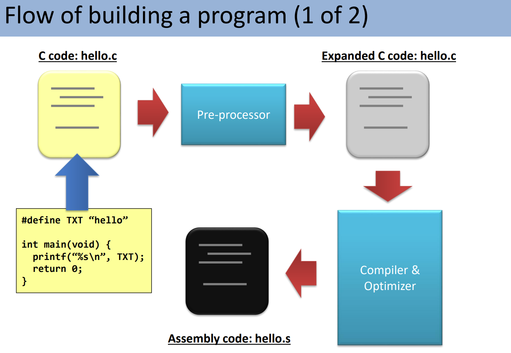

</figure>

#### 第一阶段：预处理 (Pre-processing)

**输入：**`hello.c` (原始代码) 

**输出：** 扩展后的 `hello.c`

**发生了什么：**

**文本替换与展开引擎**。它通过扫描源代码中所有以 `#` 开头的指令来修改文件内容。

核心任务：

- **处理宏定义（`#define`）**：

- **常量替换**：将代码中的宏定义（包括常量和宏函数）在所有出现的地方进行纯文本替换和展开。

- **宏函数展开**：如 宏定义`SWAP(a,b)` 例子，预处理器会将 `SWAP(i, j)` 这种调用形态，根据模板原样展开为具体的代码块 `{ int c; c = i; i = j; j = c; }`。

- **处理本质**：这种替换是纯文本的，预处理器并不理解代码背后的逻辑或语法。

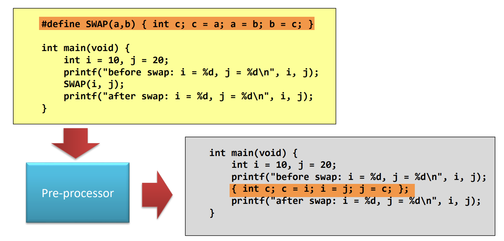

- **包含头文件（`#include`）**： 如当预处理器遇到 `#include "header.h"` 时，它会找到该头文件并将其所有内容**原样复制**到当前文件的对应位置。这意味着扩展后的代码会将主程序与所有引用的头文件内容合并为一个巨大的源文件。

- **条件编译与清理**：处理如 `#ifdef`、`#ifndef`、`#endif` 等条件编译指令，根据宏是否定义来决定保留或舍弃特定的代码段。自动剔除代码中所有给人看的注释，因为这些信息对后续的编译器和硬件没有意义。

**实用指令：**

`gcc -E hello.c` 来命令编译器在完成预处理阶段后立即停止。这样你就能直接查看经过宏展开和头文件合并后的“扩展代码”是什么样子。

#### 第二阶段：编译与优化 (Compiler & Optimizer)

**输入：** 扩展后的 C 代码

**输出：**`hello.s` (汇编代码)

**发生了什么：**

这是构建流程中最核心的转换步骤。编译器负责将经过预处理的高级语言文本，翻译成更接近硬件底层的汇编语言。

**核心任务：**

- **语法检查与分析 (Syntax Checking & Analyzing)**： 验证代码是否符合语言规范。如果发现语法错误，编译器将停止工作并报错；若无错误，则继续构建中间代码。

- **代码优化 (Optimization)**：

 **提升代码质量**：优化器负责改善“糟糕的代码（Stupid codes）”，通过调整指令顺序等手段提高运行效率或减少资源占用。

**级别控制**：用户可以通过 gcc 参数 `-O` 来控制优化程度。例如，`-O0` 表示不优化，默认通常为 `-O1`，最高可设为 `-O3` 以实现深度优化。

**低级语言翻译**：将经过校验和优化的逻辑转化为特定 CPU 架构（如 x86 或 ARM）能够理解并进一步处理的汇编指令。

**执行特征：**    `gcc -S hello.c`。

#### 第三阶段：汇编 (Assembler)

**输入：**`hello.s` (汇编代码)

**输出：**`hello.o` (目标代码/Object Code)

**发生了什么：**

汇编器将汇编指令（文本格式）翻译成真正的二进制机器码。这是程序向机器码迈进的关键一步。

**核心任务：**

- **二进制转换**：将 `hello.s` 中的文本指令（如 `mov`, `push`）翻译成 CPU 直接识别的 0 和 1。

- **生成中间产物**：产生的 `hello.o` 虽然已经是二进制形式，但由于尚未进行符号解析和库合并，它还不能直接独立运行。

- **执行方式**：在 Linux 系统中，可以使用指令 `as hello.s -o hello.o` 手动触发此过程。

#### 第四阶段：链接 (Linker)

**输入：**`hello.o` + 库文件 (Libraries)

**输出：**`hello` (可执行文件)

**发生了什么：**

链接器充当“组装员”的角色，将所有的目标文件碎片与系统库整合在一起，构建出完整的运行版程序。

**核心任务：**

- **合并库文件**：将程序中调用的外部功能（如 `printf`）从系统的**静态库**或**动态库**中“链接”进来。

- **符号解析**：修正程序中各部分之间的跳转和变量引用，确定函数和变量在内存中的最终地址。

- **最终产出**：生成最终的可执行文件。此时，双击该文件即可在操作系统中创建一个活跃的**进程**。

### 库文件 (Library Files)

**什么是库文件：**

库文件本质上是一系列函数实现的集合。在链接阶段，链接器会从中寻找目标程序所需要的具体函数代码。

#### 1. 库文件的生成

库文件是由一堆目标文件（`.o` 文件）打包而成的，主要分为两种类型：

- **静态库 (Static Library)**：

- **后缀**：通常为 `.a`（在 Linux 中称为归档文件 Archive）。

- **生成工具**：通过 `ar` 命令生成。

- **共享库/动态库 (Shared Library)**：

- **后缀**：通常为 `.so`。

- **生成工具**：通过 `gcc -shared` 命令生成。

#### 2. 两种链接方式的区别

链接器处理这两类库的方式截然不同：

- **与静态库链接 (Linking with static library)**：

- **过程**：链接器将 `.a` 库中的代码直接复制并合并到最终的可执行文件中。

- **结果**：最终程序是目标代码与库代码的**组合体**，程序体积较大，但运行时不依赖外部库文件。

- **与动态库链接 (Linking with dynamic library)**：

- **过程**：链接器仅检查 `.o` 文件中所使用的函数是否在 `.so` 文件中存在，而不进行代码复制。

- **结果**：生成的程序体积**更小**。程序在运行时才去加载所需的动态库，因此需要运行环境中有相应的 `.so` 文件支持。

### 编译多个源文件的流程

通常情况下，`gcc` 会默认隐藏所有中间步骤，直接生成可执行文件。但在处理多文件项目时，更稳妥的方案是分步进行。

#### 步骤 1：准备源文件

- **输入**：所有的 `.c` 源文件。

- **关键要求**：在所有的源文件中，**有且只能有一个**文件包含 `main` 函数。

#### 步骤 2：分别编译为目标代码

- **操作**：使用 `gcc -c` 命令逐个编译源文件。

- **输出**：生成对应的 `.o` 目标文件（Object Code）。

- **特点**：此步骤只进行编译，不进行链接。

#### 步骤 3：链接生成可执行程序

- **操作**：使用 `gcc -o` 命令将所有的 `.o` 文件链接在一起。

- **输出**：生成最终的可执行程序（如 `prog`）。

- **意义**：链接器此时会将分散的目标代码组装成一个完整的整体。

#### 为什么不直接一步到位？

虽然可以使用 `gcc -o prog *.c` 一次性完成，但分步编译（先生成 `.o` 再链接）在大型项目中效率更高：当你只修改了其中一个文件时，只需重新编译该文件生成 `.o`，最后再统一链接即可，无需重新编译整个项目。

### 程序总结

程序本质上就是一个可执行文件！

- **静态性 (Static)**：程序是存储在磁盘上的被动实体。在没有被操作系统加载运行之前，它是静止不动的。

- **关联性 (Association)**：虽然程序本身是一个整体，但它运行可能需要依赖外部的**动态链接文件**。这些文件在不同系统中后缀不同：

- 在 **Linux** 中通常表现为 `*.so` 文件。

- 在 **Windows** 中通常表现为 `*.dll` 文件。

- **多源性 (Composition)**：一个完整的程序并不一定只由单一的源代码生成，它可以是由**多个源文件**共同编译、链接而成的。

### 什么是进程？

当一个可执行文件从磁盘加载到内存中时，它就从一个静态的“程序”变成一个活跃的「进程」。

**上面说的程序也被称为  可执行可链接文件（ELF），是程序在未运行时的“原始形态”，它规定了可执行文件在磁盘上是如何组织的。**

是一种用于二进制文件、可执行文件、目标代码、共享库等的标准文件格式。

- **常见应用**：广泛见于 Linux 和 Android 系统的可执行文件、共享库（`.so` 或 `.a`）以及中间目标文件（`.o`）。

**进程创建后，将ELF格式的内容按照一定空间布局映射到内存中**

### 进程在内存中空间分布

<figure class="process-figure-row">

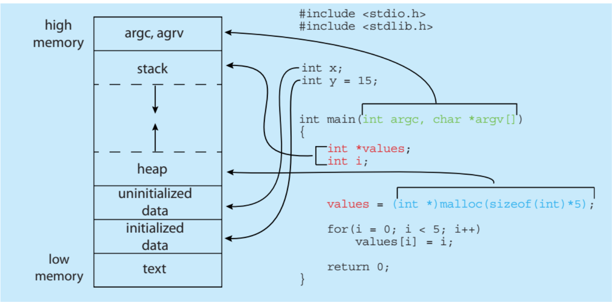

</figure>

### **查看某进程的内存空间布局**

• 命令：cat /proc/PID/maps

• 查看所有进程信息：ps -aux

### 进程的状态

典型的进程状态包括：

- **创建态 (new)**：进程正在被创建。

- **运行态 (running)**：指令正在被执行。在任何给定的时刻，**一个处理器上只能运行一个进程**。

- **等待态 (waiting)**：进程正在等待某个事件的发生（例如 I/O 操作完成或接收到特定信号）。

- **就绪态 (ready)**：进程已经准备好，正在等待被分配给处理器执行。系统中可能同时存在**许多进程**处于就绪或等待状态。

- **终止态 (terminated)**：进程已经结束执行。

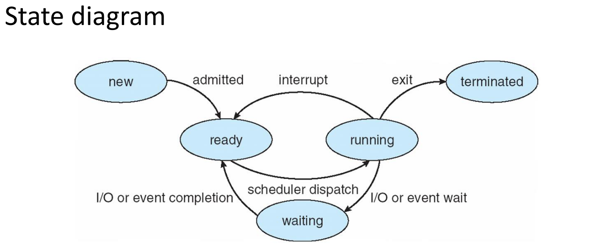

在任意时刻，每个处理器上只能运行一个进程。 

可能有多个进程处于就绪或等待状态。

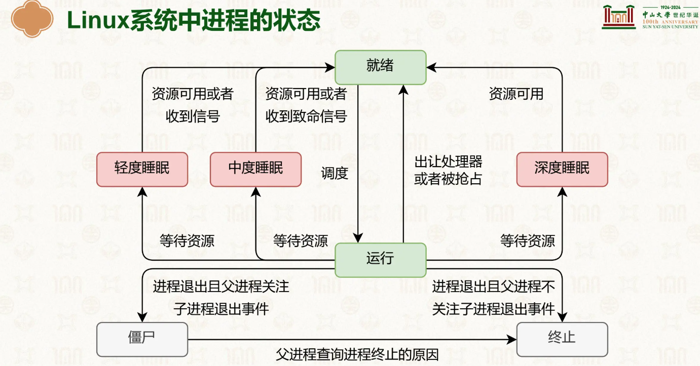

### 如何切换进程？

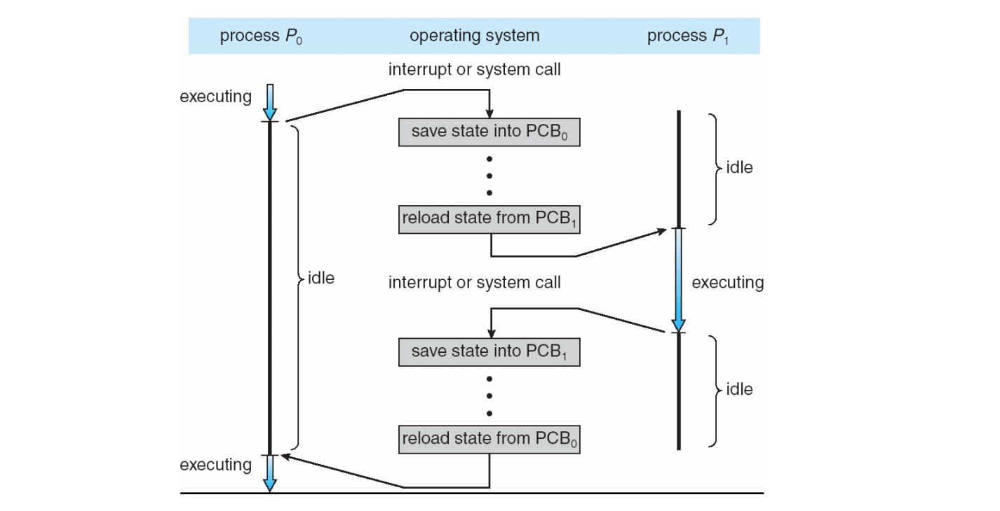

**在操作系统中，每一个进程都由一个专门的数据结构来表示，这就是进程控制块 (Process Control Block, PCB)，有时也称为任务控制块。**

### PCB 的核心组成部分

- **进程状态 (Process state)**：记录进程当前所处的阶段，如运行态、等待态、就绪态等。

- **进程编号 (Process number/PID)**：每一个进程在系统中的唯一标识符。

- **程序计数器 (Program counter)**：指示该进程即将执行的下一条指令的内存地址。

- **CPU 寄存器 (CPU registers)**：保存进程在被中断时的所有寄存器内容，以便下次恢复运行时能从断点继续。

- **CPU 调度信息 (CPU scheduling information)**：包括进程的优先级、指向调度队列的指针等，用于决定哪个进程优先获得 CPU。

- **内存管理信息 (Memory-management information)**：定义了分配给该进程的内存范围（内存限制）及其页表或段表信息。

- **I/O 状态信息 (I/O status information)**：列出分配给该进程的 I/O 设备以及目前打开的文件列表。

- **记账信息 (Accounting information)**：记录 CPU 使用时长、自启动以来经过的时钟时间以及相关的时间限制。

### PCB数据结构

在 Linux 操作系统中，进程是通过一个特定的 C 语言结构体`task_struct` 来表示的，它定义在内核头文件 `<linux/sched.h>` 中。

### 1. `task_struct` 的核心字段

- `**pid t_pid**`: 进程标识符（Process Identifier），用于唯一标识系统中的每一个进程。

- `**long state**`: 记录进程的当前状态（如运行、阻塞、停止等）。

- `**struct sched_entity se**`: 包含进程的调度信息，用于内核决定该进程何时以及在 CPU 上运行多久。

- `**struct task_struct *parent**`: 指向该进程父进程的指针，体现了 Linux 进程的树状层级结构。

- `**struct list_head children**`: 一个链表表头，保存了该进程产生的所有子进程的信息。

- `**struct files_struct *files**`: **指向已打开文件列表的指针，记录了进程当前访问的所有文件描述符。**

- `**struct mm_struct *mm**`: 指向该进程地址空间的指针，定义了进程在内存中的虚拟内存布局。

### 2. 内核如何管理这些结构

Linux 内核管理进程的方式：

- **双向链表结构**: 所有的 `task_struct` 实例通过指针连接在一起，形成一个双向循环链表。这使得内核可以轻松地遍历系统中的所有进程。

- `**current**` **指针**: 内核使用一个特殊的 `current` 指针来指向当前正在 CPU 上执行的进程。通过这个指针，内核可以快速访问当前任务的所有属性。

简单来说，`task_struct` 就是 Linux 系统中的 **PCB（进程控制块）**。它不仅是进程的身份卡，也是内核对其进行调度、内存分配和资源管理的核心依据。

### 进程数据与 PCB 的关系

一个完整的进程跨越了 用户空间（User space） 和 内核空间（Kernel space） 两个领域。

#### 1. 用户空间：进程数据

在用户空间中，进程主要包含它运行所需的各种数据和指令：

- **全局变量 (Global variable)**：存储在数据段（Data section）中。

- **局部变量 (Local variable)**：存储在栈（Stack）中。

- **动态分配的内存 (Dynamically-allocated memory)**：存储在堆（Heap）中。

- **代码与常量 (Code + constants)**：存储在代码段（Text section）中。

#### 2. 内核空间：管理实体 (PCB)

在内核空间中，操作系统通过 进程结构体（PCB） 来代表和管理该进程。

- PCB 是内核中用于跟踪进程状态、优先级、内存限制等核心信息的控制实体。

### 交互机制：系统调用 (System Calls)

用户空间的进程无法直接访问内核空间中的 PCB。它们之间的交互必须通过 系统调用（System calls） 来完成：

- **调用过程**：用户代码通过调用如 `fork()`、`exec*()` 或 `wait()` 等系统调用，触发从用户态向内核态的切换。

- **内核处理**：带有系统调用的内核代码会接收到请求，并 **访问进程的内部结构 (PCB)** 来执行具体操作（如创建新进程、更改执行程序或等待子进程结束）。

- **访问权限**：这种设计建立了一个安全边界，确保只有内核代码有权修改 PCB 这种敏感的系统数据，而普通进程数据则被限制在用户空间内。

**总结**：

进程数据是程序“做什么”的物质基础（位于用户空间），而 PCB 是操作系统“怎么管”的行政记录（位于内核空间）。系统调用则是连接这两个世界的唯一桥梁。

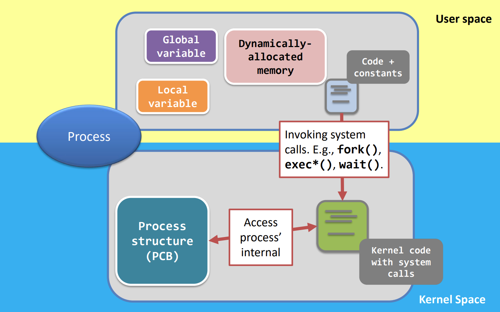

### 进程总结

### 进程的本质：正在执行的程序

进程不仅仅是存在于磁盘上的文件，它是程序的动态实例。

- **动态 vs 静态**：程序是存储在磁盘上的**静态实体**（Static entity），而进程是正在运行的**活动实体**（Active entity）。

- **为何是“活动”的？**：因为它拥有**程序计数器（Program Counter）**来指向下一条要执行的指令，并伴随有一系列**相关的系统资源**。

- **执行限制**：在任何给定的瞬间，一个处理器上**只能运行一个进程**。

### 进程与程序的多对一关系

一个程序可以对应多个进程，但每个进程都是独立的。

- **多实例运行**：两个进程可以关联同一个程序（例如，同一个用户打开了两个浏览器窗口，或两个不同的用户运行同一个程序）。

- **独立的执行序列**：虽然它们的**代码段（Text section）可能相同，但它们的**数据段（Data）、堆（Heap）**和**栈（Stack）空间是完全独立的，互不干扰。

### 进程作为执行环境

进程还可以作为其他代码运行的载体。

- **示例：Java 运行环境**：当你运行一个 Java 程序时，系统实际上是启动了一个 **JVM（Java 虚拟机）进程**，由该进程负责执行你的 Java 代码。

## 进程操作

**进程是操作系统中资源分配的基本单位。没有进程，操作系统将无法运行任何任务。**一个进程通常关联以下资源信息：

- **文件关联**：它与该进程打开的所有文件相关联。

- **内存分配**：它连接到所有为其分配的内存空间。

- **记账信息 (Accounting Information)**：包含运行时间、当前内存使用情况、进程所有者（UID）等。

为了有效管理进程，系统必须提供以下四种核心机制：

- **进程标识 (Identification)**：为每个进程提供唯一身份（如 PID）。

- **进程创建 (Creation)**：支持从父进程派生新进程。

- **程序执行 (Execution)**：将程序代码加载并运行。

- **进程终止 (Termination)**：清理并回收进程占用的资源。

在 Linux/Unix 类系统中，通过以下基础系统调用来实现上述操作：

| **系统调用** | **功能描述** |
| --- | --- |
| `**getpid()**` | 获取当前进程的唯一标识符（PID）。 |
| `**fork()**` | 创建一个与当前进程几乎完全一样的子进程。 |
| `**exec*()**` | 用一个新的程序替换当前进程的执行镜像。 |
| `**wait()**` | 让父进程等待子进程结束，并回收其资源。 |
| `**exit()**` | 正常终止当前进程的运行。 |

### 进程标识

### 1. 什么是 PID？

在操作系统中，每一个进程都会被分配一个唯一的数字标识符，称为 进程 ID (Process ID)，简称 PID。

- **唯一性**：每个运行中的进程其 PID 都是独一无二的。

- **动态性**：如图片中的命令行示例所示，即使运行的是同一个可执行程序（`./getpid`），每次执行时系统都会为其分配一个新的 PID（例如 1234, 1235, 1237）。

### 2. 如何获取 PID？

程序员可以通过特定的系统调用在代码中获取当前进程的 ID：

- **系统调用**：使用 `**getpid()**` 函数。

- **头文件**：在 C 语言中，需要包含 `<unistd.h>` 头文件才能使用此函数。

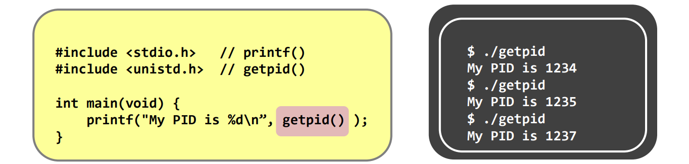

### 进程创建

### 1. 父进程与子进程的关系

在操作系统中，进程不是孤立存在的，它们可以通过“繁衍”产生新的进程：

- **父进程 (Parent process)**：发起创建动作的原始进程。

- **子进程 (Children processes)**：被创建出来的新进程。一个父进程可以创建多个子进程，从而形成树状的进程层级结构。

### 2. 系统的“始祖”进程：init

所有进程的起源都可以追溯到系统启动时创建的第一个进程：

- **创建者**：由操作系统**内核 (Kernel)** 在引导（Booting up）过程中手动创建。

- **名称**：该进程被称为 `**init**`。

- **进程标识**：它的 **PID 始终为 1**。

- **程序路径**：它运行的二进制代码通常位于 `**/sbin/init**`。

### 3. init 进程的任务

一旦 `init` 进程启动，它的首要任务就是 **创建更多进程**。这些后续进程会进一步启动系统服务、用户登录界面等，最终构建出完整的用户运行环境。

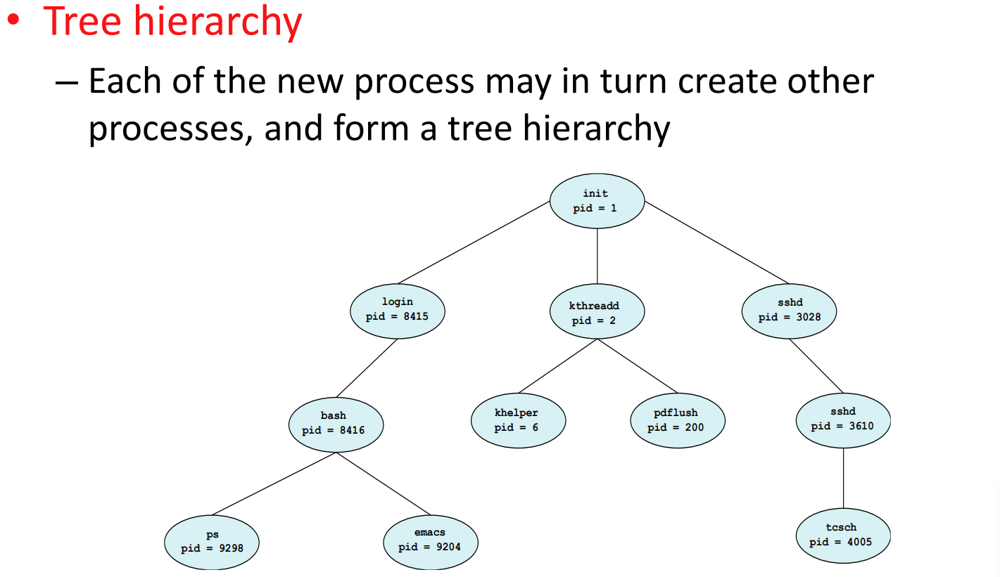

### 4. 进程树的生长与查看

在 Linux 中，进程通过父子关系组织成一棵树。你可以使用特定的命令来直观地观察这种结构：

- **查看命令**：使用 `pstree` 可以查看当前的进程树。

- **显示优化**：使用 `pstree -A` 可以仅使用 ASCII 字符显示，方便在某些不支持图形符号的终端中阅读。

- **创建机制**：一个进程（如 `init`）通过 `fork()` 和 `exec*()` 系统调用创建子进程（如 SSH server），子进程可以继续创建孙进程（如 Shell），以此类推。

### 5. 孤儿进程 (Orphan Process) 的产生

进程的终止可能发生在任何时刻。当一个父进程在子进程之前结束时，就会产生“孤儿”：

- **资源回收**：当进程终止时，其所有资源都会被释放回操作系统。

- **结构破坏**：如果父进程（如 Shell）被关闭，而它的子进程（如 `top`）仍在运行，该子进程就变成了**孤儿进程**。

- **潜在风险**：正常情况下，父进程负责监控子进程的终止状态；如果父进程不在了，孤儿进程的状态可能无人知晓。

### 6. Linux 的修复机制：重父操作 (Re-parent)

为了维持进程系统的稳定性，Linux 不允许进程结构变成散乱的“森林”，而是通过“收养”机制确保始终只有一棵树：

- **收养者**：`init` 进程会充当所有孤儿进程的“继母”。

- **重父操作**：当一个父进程消失后，系统会自动执行 **re-parent** 操作，将孤儿进程重新连接到 `init` 进程下。

- **系统对比**：值得注意的是，Windows 系统维持的是一种类似于“森林”的结构，并不一定像 Linux 这样强行统一到单一根节点下。

### 7. 实际应用

- **唯一性**：由于重父操作的存在，Linux 中的进程始终且仅组织为**一棵进程树**。

- **后台运行**：重父机制允许进程在没有父终端的情况下继续运行。这也是为什么**后台任务 (Background jobs)** 在你关闭终端窗口后仍能继续执行的原因。

### 父子进程间的关系

### 1. 资源共享选项 (Resource sharing options)

当父进程创建子进程时，关于资源（如内存、文件句柄等）的共享有三种可能性：

- **完全共享**：父进程和子进程共享所有资源。

- **部分共享**：子进程只共享父进程资源的一个子集。

- **不共享**：父进程和子进程不共享任何资源。

### 2. 执行选项 (Execution options)

父子进程在运行时间线上的关系：

- **并发执行**：父进程和子进程同时运行，互不等待。

- **同步等待**：父进程进入阻塞状态，直到子进程终止后才继续执行。

### 3. 地址空间选项 (Address space options)

这是进程创建中关于内存内容的关键区别：

- **完全复制**：子进程是父进程的副本（拥有相同的内存内容和程序计数器）。

- **加载新程序**：子进程在创建后，会有一个全新的程序加载到其地址空间中运行。

可以这样理解：

- `**fork()**` **系统调用**：对应“**完全复制**”和“**并发执行**”。子进程复制父进程的地址空间，随后两者同时从 `fork()` 返回处开始运行。

- `**exec*()**` **系统调用**：对应“**加载新程序**”。它会覆盖当前进程的地址空间，用一个全新的程序（如 `ls` 或 `top`）替换。

- `**wait()**` **系统调用**：对应“**父进程等待子进程终止**”。父进程会暂停执行，直到子进程结束。

这些机制确保了 Linux/UNIX 系统能够灵活地管理任务。

### fork()

虽然两个进程执行相同的代码，但我们可以通过 `fork()` 的**返回值**来区分它们：

| **进程类型** | **fork() 的返回值** | **说明** |
| --- | --- | --- |
| **子进程** | `**0**` | 在子进程中，`fork()` 返回 0。 |
| **父进程** | **子进程的 PID** | 在父进程中，`fork()` 返回新创建的子进程的 ID（一个正整数）。 |

**关键点总结：**

- `fork()` 调用一次，返回两次。

- 子进程是父进程的副本，但拥有唯一的 PID。

- 父子进程是并发执行的，除非使用 `wait()` 显式同步。

`fork()` 通过克隆父进程来创建子进程，被克隆的内容包括：

- **程序代码**：父子进程共享同一段物理代码。

- **内存数据**：包括局部变量、全局变量以及动态分配的内存。

- **打开的文件**：父进程打开的文件，子进程会自动同样打开。

- **程序计数器 (PC)**：这解释了为什么两者都会从 `fork()` 返回后的同一行代码开始执行。

尽管进行了大量克隆，但以下关键内核数据在父子进程中是截然不同的：

| **差异项** | **父进程 (Parent)** | **子进程 (Child)** |
| --- | --- | --- |
| `**fork()**` **返回值** | **子进程的 PID** (如 1235) | **0** |
| **自身 PID** | 保持不变 | 获得一个新的、唯一的 PID |
| **父进程标识** | 保持不变 | 其父进程指向创建它的进程 |
| **运行时间** | 累计运行时间 | 刚刚创建，运行时间为 0 |

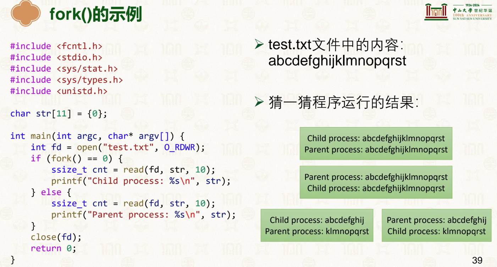

这里的核心知识点是：**在** `**fork()**` **之前打开的文件，父子进程会共享同一个“打开文件描述（Open File Description）”。**

我们可以把程序的执行过程拆解来看：

1. `**open()**` **阶段（**`**fork**` **之前）** 父进程调用 `open()` 打开了 `test.txt`。此时，内核在系统级的文件表中创建了一个条目，这个条目里记录了当前的**文件读写指针（File Offset）**，初始值为 `0`。

2. `**fork()**` **阶段** 父进程执行 `fork()` 创建子进程。子进程不仅复制了父进程的内存，还**复制了父进程的文件描述符表**。 **关键点**：父进程的 `fd` 和子进程的 `fd` 现在指向了内核中**同一个**打开文件表项。这意味着，**它们共享同一个文件读写指针**。

3. `**read()**` **阶段（并发执行）** 由于我们没有使用类似 `wait()` 的同步机制，父子进程谁先执行由操作系统的调度器决定。

- **假设子进程先被调度运行**：子进程调用 `read` 读取 10 个字节。它从偏移量 `0` 开始读，读到了 `abcdefghij`。读完后，内核会将那个**共享的文件指针**向后移动 10 位，指向 `k`。

- **随后父进程运行**：父进程调用 `read` 读取 10 个字节。由于文件指针已经被子进程移动到了 `10`，父进程会接着从 `k` 开始读，读取到 `klmnopqrst`。

- （如果父进程先被调度，结果则反过来）。

**区别于我们之前讨论的内存写时复制（CoW）——即父子进程的变量修改互不影响；**

**打开的文件状态（尤其是读写指针）在父子进程间是紧密耦合的。一方的读写操作会直接影响另一方的读取位置。**

**如果父子进程都需要操作同一个日志文件，必须非常小心地处理并发写入的问题，通常需要引入文件锁（File Lock）机制。**

### 进程执行

虽然 `fork()` 可以创建新进程，但它只是简单的“自我克隆”。

- **局限性**：如果一个进程只能复制自己并运行相同的程序，我们就无法执行其他不同的任务。

- **解决方案**：为了实现“改变”，我们需要 `exec()` 系列系统调用来在当前进程中加载并运行一个新的程序。

`execl()` 是 `exec` 家族的 6 个成员之一。它的核心作用是将当前进程的映像替换为指定的可执行文件。

#### `execl()` 的参数结构

以 `execl("/bin/ls", "/bin/ls", "-l", NULL);` 为例：

- **第 1 个参数**：要执行的文件路径（如 `"/bin/ls"`）。

- **第 2 个参数**：传递给新程序的第一个命令行参数。按照惯例，这通常是程序名本身。

- **后续参数**：传递给新程序的其他命令行参数（如 `"-l"`）。

- **最后一个参数**：必须是 `NULL`，用于标记参数列表的结束。

`exec()` 系列函数不仅仅是“调用”一个命令，而是**彻底替换**当前进程。

- **无法返回**：一旦 `exec()` 执行成功，原程序的代码段、数据段和堆栈都会被新程序覆盖。

- **进程终结**：新程序（如 `/bin/ls`）执行完毕后，会通过 `return` 或 `exit()` 结束进程。

- **后果**：原程序中位于 `exec()` 调用之后的任何代码都**永远不会被执行**。

当进程执行 `exec()` 时，它会经历一次大范围的清理，但也会保留一些核心身份信息：

#### **抛弃的内容 (Throw Away)**

- **内存空间**：包括所有的局部变量、全局变量以及通过 `malloc` 等动态分配的内存。

- **寄存器状态**：包括程序计数器 (PC)，它将被重置为新程序的入口地址。

#### **保留的内容 (Preserve)**

- **PID (进程标识符)**：虽然内核代码变了，但进程的身份证号没变。

- **进程关系**：父进程依然是原来的父进程。

- **统计信息**：如累计运行时间等。

### 核心对比：`fork()` vs `exec()`

结合您之前的学习内容，这两者的协作构成了 Linux 创建新任务的完整流程：

| **特性** | **fork()** | **exec()** |
| --- | --- | --- |
| **主要功能** | 创建一个原进程的副本 | 在当前进程加载新程序 |
| **内存变化** | 复制一份完全相同的内存 | 丢弃旧内存，加载新程序的内存 |
| **PID** | 子进程获得一个新的 PID | 维持原有的 PID 不变 |
| **代码执行** | 父子进程从同一位置继续执行 | 从新程序的 `main` 函数开始执行 |

### 实际应用场景

这种机制解释了 shell（终端）的工作原理：

当你输入 `ls` 时，shell 先 `fork()` 出一个子进程，然后在子进程里执行 `execl("/bin/ls", ...)`。

这样既运行了新程序，又保证了 shell 本身不会因为执行完 `ls` 就消失。

### 进程等待

### 1. 核心问题：执行顺序的可控性

在只有 `fork()` 和 `exec()` 的情况下，父进程和子进程的执行顺序由操作系统的调度器决定，这是不可预测的。为了实现类似 `system()` 的同步调用（即父进程必须等待命令执行完再继续），我们需要解决两个问题：

- **挂起 (Suspend)**：如何让父进程暂停执行？

- **唤醒 (Wake)**：子进程结束后，如何通知并唤醒父进程？

### 2. `wait()` 系统调用的同步逻辑

`wait()` 的引入解决了进程间的同步问题。其执行逻辑分为两种情况：

- **情况 1：挂起与唤醒** 如果调用 `wait()` 时子进程仍在运行，父进程会被**挂起**（进入阻塞状态）。直到其中一个子进程从“运行”变为“终止”状态，`wait()` 才会返回并**唤醒**父进程。

- **情况 2：立即返回** 如果调用 `wait()` 时已经没有正在运行的子进程，或者子进程已经提前终止，则父进程**不会被挂起**，`wait()` 会直接返回。

### 3. 实现 `system()` 的完整流程

通过 `image_0c56c2.png` 中的代码示例，我们可以看到一个模拟 `system()` 的实现：

1. `**fork()**`：创建子进程。

2. **子进程执行** `**execl()**`：在子进程中启动指定的命令（如 `/bin/ls`）。如果命令不存在，则调用 `exit(-1)` 退出。

3. **父进程执行** `**wait(NULL)**`：父进程在第 9 行被挂起，等待子进程执行完毕。

4. **继续执行**：子进程结束后，父进程被唤醒，继续执行第 10 行及之后的代码。

### 4. `wait()` 的局限性与增强

虽然 `wait()` 很有用，但它有两个主要限制：

- **不可控性**：它会等待**任意一个**子进程结束。

- **功能单一**：它仅能检测子进程的终止。

为了解决这些问题，操作系统提供了更强大的 `**waitpid()**` 系统调用，允许程序员指定等待某一个特定的进程 PID。

### `wait()` vs `waitpid()`：同步的艺术

虽然两者都用于同步父子进程，但 `waitpid()` 提供了更精细的控制：

| **特性** | **wait()** | **waitpid()** |
| --- | --- | --- |
| **等待目标** | 等待**任意一个**子进程结束。 | 可以指定等待**特定的**某一个子进程（基于 PID）。 |
| **状态检测** | 仅能检测子进程的**终止 (Termination)**。 | 可以检测子进程的**状态变化**，包括从运行到挂起、从挂起到运行。 |

## 真实的进程操作运行机制

当我们从用户空间（User Space）调用 `fork()`, `exec()`, 和 `wait()` 时，

我们实际上是通过**系统调用（System Call）**触发了特殊的硬件指令（如 **`syscall`** 或陷阱中断），将 CPU 的执行权限交给操作系统的**内核（Kernel）**。

在内核态下，操作系统会直接操作硬件（如 MMU 内存管理单元）和底层的核心数据结构。以下是这三个系统调用在内核中的真实运作机制：

### 1. `fork()`：写时复制（Copy-on-Write, CoW）与 PCB 克隆

在早期的 Unix 系统中，`fork()` 会把父进程的物理内存傻乎乎地全部复制一份给子进程，这极其低效。现代操作系统的内核（如 Linux）采用了非常聪明的做法：

- **克隆进程控制块 (PCB)**：内核首先分配一个新的 `task_struct`（Linux 中的 PCB），并将父进程的绝大部分属性（如寄存器状态、打开的文件描述符表）直接拷贝过来，并分配一个新的 PID。

- **页表映射与写时复制 (CoW)**：**内核不会复制物理内存**。相反，它只复制父进程的“虚拟内存页表”。此时，父子进程的虚拟地址指向**同一块物理内存**。

- **权限收缩**：内核将这块共享的物理内存的权限标记为“只读”。

- **触发分离**：当父进程或子进程试图修改（Write）这块内存中的某个变量时，由于权限是“只读”，CPU 会触发一个**缺页异常（Page Fault）**。内核捕获这个异常后，才会真正分配一块新的物理页面，把数据拷贝过去，并将该页面的权限恢复为可写。这种“按需复制”极大地提升了系统性能。

### 2. `exec()`：地址空间的“大清洗”与重建

当子进程调用 `exec()` 家族函数时，内核执行的是一场“破而后立”的操作。由于 `exec()` 要加载一个全新的程序（通常是 ELF 格式的可执行文件），之前的写时复制策略在此刻被彻底终结。

- **解除映射 (Unmap)**：内核会遍历当前进程的页表，解除对旧程序代码段、数据段、堆和栈的所有物理内存映射。如果某些物理页面只有当前进程在使用，内核会将其回收释放。（_注：在这个复杂的释放和地址空间切换过程中，如果内核的引用计数或锁机制存在漏洞，很容易成为 UAF (Use-After-Free) 等内存破坏漏洞的触发点，这也是底层安全和模糊测试重点关注的区域。_）

- **加载新程序**：内核读取要执行的 ELF 文件头部，解析出程序的入口地址以及各个段（如 `.text` 代码段, `.data` 数据段）的内存分布要求。

- **重新建立映射**：内核为新程序分配新的虚拟内存空间，建立新的页表。但此时并不立即分配物理内存（按需加载，Demand Paging），而是等到程序实际执行到该处代码时再分配。

- **重置上下文**：内核将栈指针（SP）和指令寄存器（PC/RIP）重置为新程序的初始状态和入口点，并把用户传入的参数（如 `argc`, `argv`）压入新的用户栈中。

### 3. `wait()`：调度队列与“僵尸”回收

`wait()` 涉及到操作系统最核心的进程调度（Process Scheduling）逻辑。

- **挂起（Suspend）**：当父进程调用 `wait()` 且子进程还在运行时，内核会将父进程的 PCB 状态从 `TASK_RUNNING`（就绪/运行状态）修改为 `TASK_INTERRUPTIBLE`（睡眠/等待状态），并将其从 CPU 的运行队列移出，放入一个等待队列（Wait Queue）中。此时父进程交出 CPU 执行权。

- **子进程终止与“僵尸 (Zombie)”态**：当子进程执行 `exit()` 时，内核会回收它占用的内存、打开的文件等绝大部分资源。但是，内核**不会立即销毁它的 PCB**。子进程会进入一种特殊的状态——**僵尸进程（Zombie Process，状态码** `**Z**`**）**。保留 PCB 的唯一目的，是为了让父进程能够读取它的退出状态码（Exit Status）。

- **唤醒（Wake up）与收割**：子进程在 `exit()` 的最后一步，会向其父进程发送一个 `SIGCHLD` 信号。内核顺势检查父进程是否在等待队列中。如果在，内核将父进程的状态改回 `TASK_RUNNING`，重新放回运行队列。父进程醒来后，读取僵尸子进程 PCB 中的退出状态，随后内核彻底销毁该子进程的 PCB。

## 内核空间和用户空间的隔离机制

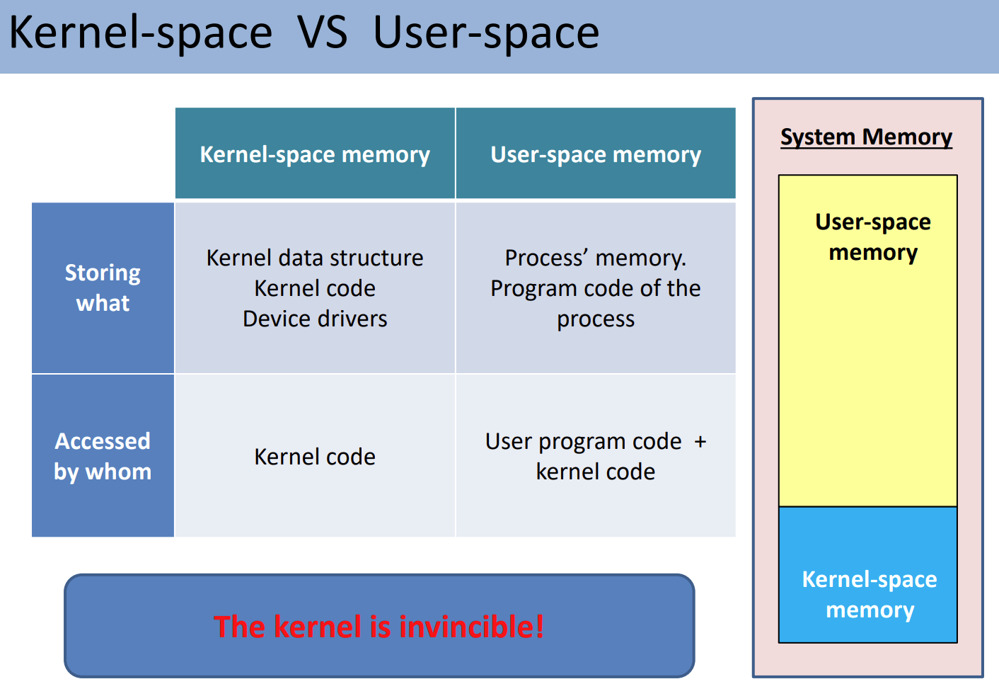

### 为什么说“内核是不可战胜的”？

“The kernel is invincible!” 这一结论源于 OS 的稳定性和安全性需求：

- **故障隔离**：用户空间程序的崩溃（比如由于逻辑错误导致的死循环或非法内存访问）仅会影响该程序自身。由于它无法触碰内核空间，OS 整体依然可以稳定运行。

- **特权指令限制**：所有涉及硬件的操作（如读写磁盘、修改内存映射）都必须在内核态下执行。如果用户程序想做这些事，唯一的合法途径是请求内核代劳。

一个进程在生命周期内，其执行权会在两个空间之间切换：

- **用户空间 (User-space)**：普通程序代码运行的地方。

- **内核空间 (Kernel-space)**：操作系统核心代码运行的地方，拥有最高权限。

- **切换方式**：这种切换是通过**调用系统调用**实现的。

### 执行流程详解：以 `getpid()` 为例

我们可以通过 程序计数器（Program Counter, PC） 的指向来追踪 CPU 的行为：

#### 阶段 A：用户态执行

- **位置**：CPU 正在运行进程的代码，这些代码存储在**用户空间内存**中。

- **状态**：程序计数器指向用户空间的一段指令。

#### 阶段 B：触发系统调用

- **触发**：进程执行到需要获取自身 PID 的代码，于是调用 `getpid()`。

- **查找信息**：PID 存储在 **PCB（进程控制块）** 中，而 PCB 位于**内核空间内存**。用户程序无法直接访问。

- **空间切换**：CPU 捕获到这个请求，将程序计数器的指向从用户空间**切换到内核空间**。

#### 阶段 C：内核态处理

- **执行**：内核代码接管 CPU，从内核空间的 PCB 中读取该进程的 PID 信息。

- **保护**：此时 CPU 处于特权模式，可以安全地操作内核数据。

#### 阶段 D：返回用户态

- **结束**：`getpid()` 执行完毕，内核将结果（PID 值）准备好。

- **切回**：CPU 将程序计数器重新指向用户空间内存中紧接着 `getpid()` 的下一条指令，进程继续以用户态运行。

### 用户时间和内核时间

### 1. 硬件层面的开关：Mode Bit

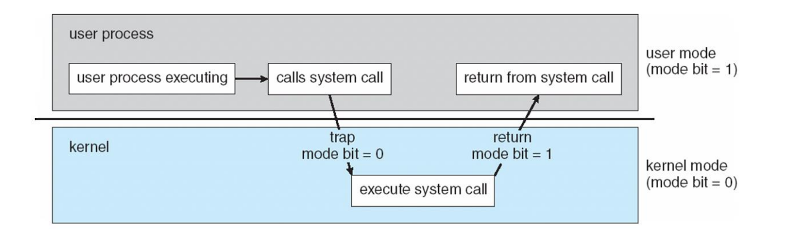

CPU 如何在硬件层面区分当前处于哪种模式：

- **用户模式 (User Mode)**：`mode bit = 1`。此时 CPU 受到限制，只能访问用户空间内存。

- **内核模式 (Kernel Mode)**：`mode bit = 0`。通过 **Trap（陷阱）** 指令切换到此模式后，CPU 拥有最高权限，可以执行系统调用。

- **切换过程**：用户进程调用系统调用 触发 Trap 修改 Mode Bit 为 0 执行内核代码 执行完毕后修改 Mode Bit 为 1 返回用户进程。

### 2. 时间的划分：User Time vs System Time

一个进程的总执行时间被拆分为两部分：

- **用户时间 (User Time)**：

- 定义：CPU 执行存储在**用户空间内存**中的代码所花费的时间。

- 特征：这是你编写的业务逻辑、算法执行的时间。

- **系统时间 (System Time)**：

- 定义：CPU 执行存储在**内核空间内存**中的代码（即执行系统调用）所花费的时间。

- 特征：这部分时间通常用于处理 I/O 操作（如读写磁盘）、内存分配或进程间通信。

### 3. 为什么这个区分对 OS 学习很重要？

通过观察这两个时间的比例，你可以判断程序的性能瓶颈：

1. **高 User Time，低 System Time**：

    说明你的程序主要是“计算密集型”（CPU-bound），比如在做复杂的数学运算。

2. **低 User Time，高 System Time**：

    说明你的程序频繁地与内核交互，可能是“I/O 密集型”或者存在频繁的上下文切换。例如，如果你在一个循环里反复调用 `getpid()` 这种简单的系统调用，虽然单次很快，但累积起来的系统时间会非常显著。

### OS 进阶思考

在 Linux 环境下，你常用的 `time` 命令（如 `time ./my_program`）输出的结果中，`user` 和 `sys` 就分别对应了图中的这两个概念。

用户时间和系统时间共同决定了一个应用程序的**性能**：

1. **系统调用 (System call)** 在性能中起着主要作用。

2. **阻塞式系统调用 (Blocking system call)**：某些系统调用甚至会**停止你的进程**，直到数据就绪为止。

### 程序员应关注的系统性能

一个经典的对比说明了如何优化代码以减少系统负担：

**低效方案：**逐个字节（byte-by-byte）读取文件。这会导致大量的系统调用，显著增加系统时间。

**高效方案：**按块（block-by-block）读取文件，例如每个块的大小为 4,096 字节。这种方式通过减少系统调用的频率来大幅提升效率。

简而言之，减少昂贵的系统调用次数（如通过合并输入/输出操作）是提升程序运行速度的关键。

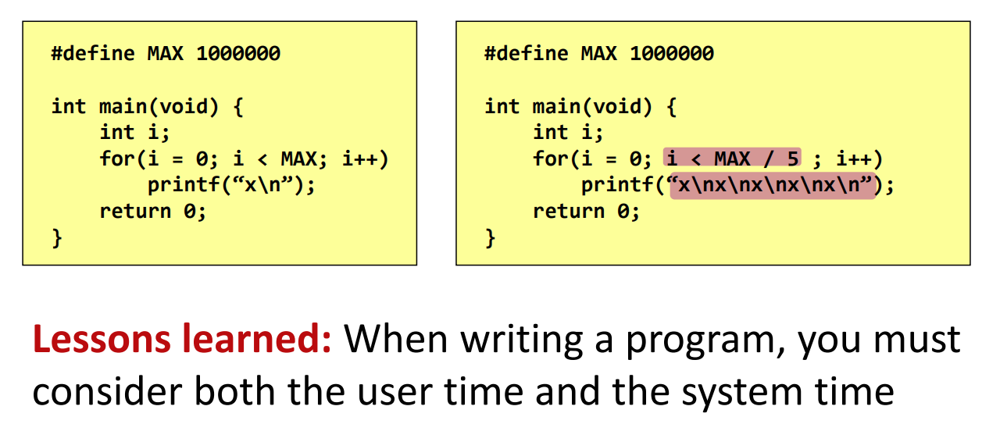

### 系统调用如何工作

### fork()

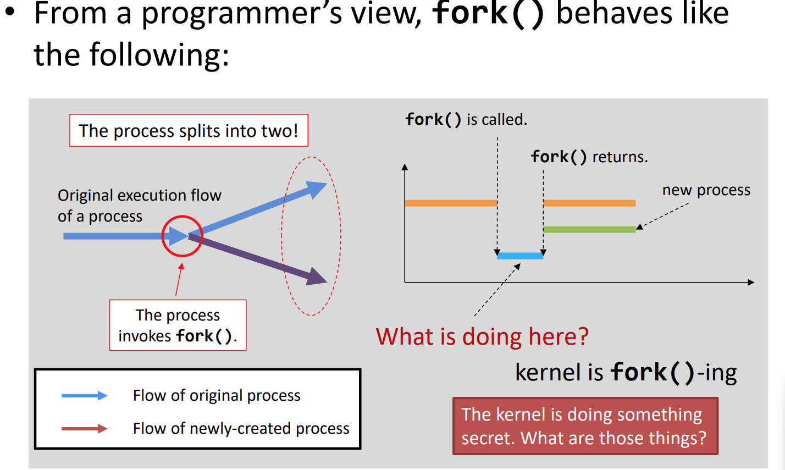

`fork()` 的行为非常像“细胞分裂”，它通过从父进程**克隆**来创建子进程。以下是会被克隆（共享或复制）的项目：

| **克隆项目** | **描述** |
| --- | --- |
| **程序计数器 (Program counter)** | 这就是为什么父子进程在 `fork()` 返回后，都会从**同一行代码**开始继续执行。 |
| **程序代码 (Program code)** | 它们共享同一段物理内存中的代码。 |
| **内存 (Memory)** | 包括局部变量、全局变量以及动态分配的堆内存。 |
| **打开的文件 (Opened files)** | 如果父进程打开了文件“A”，子进程也会自动拥有打开的文件“A”。 |

尽管大部分内容都被克隆了，但为了区分这两个进程，内核内存中的某些关键数据是不一致的：

| **差异项目** | **父进程 (Parent)** | **子进程 (Child)** |
| --- | --- | --- |
| `**fork()**` **的返回值** | **子进程的 PID**（进程 ID）。 | **0**。 |
| **PID (进程 ID)** | 保持不变。 | **新的唯一 PID**（不一定是“父 PID + 1”）。 |
| **父进程 (Parent process)** | 保持不变。 | 其父进程即为发起 `fork()` 的那个进程。 |
| **运行时间 (Running time)** | 累计的运行时间。 | **0**（因为刚刚被创建）。 |

**内核中的进程组织**

- **任务列表 (Task List)**：在内核空间中，所有进程都被组织成一个**双向链表 (Doubly Linked List)**。

- **节点本质**：链表中的每个节点实际上是一个**进程控制块 (PCB, Process Control Block)**，在 Linux 中通常指 `task_struct` 结构体。它包含了进程的所有元数据。

**1. fork() 在操作系统内核（OS Kernel）层面的过程**可以归纳为“拷贝、修改、链接”三个关键步骤：

**第一阶段：拷贝 (Copying)**

当父进程调用 `fork()` 时，内核会创建一个新的 PCB 节点，并将父进程 PCB 中的大部分内容**完整克隆**到新节点中。

**第二阶段：内核空间更新 (Kernel-space Update)**

虽然大部分内容是拷贝的，但内核必须对新进程进行差异化处理：

- **PID 更新**：子进程获得一个全新的唯一 ID（如从 1234 变为 1235）。

- **运行时间重置**：子进程的运行时间（Running time）被清零（reset to 0）。

- **文件描述符保留**：已打开的文件列表（Array of opened files）被完整保留，实现文件共享。

- **关系链建立**：

- **父进程更新**：在父进程的“子进程列表”（List of children）中添加该新成员。

- **子进程更新**：子进程的“父进程指针”（Pointer to my parent）指向父进程。

**第三阶段：正式引入 (Introduction)**

- **链表插入**：完成更新后的子进程 PCB 节点被正式插入到内核的任务双向链表中。

- 此时，系统正式承认该进程，它将进入就绪队列等待 CPU 调度。

`fork()` 的本质是在内核中利用**现有进程作为模板**，通过**深拷贝 (Deep Copy)** 快速生成新进程。这种机制极大地降低了创建进程的开销，因为内核不需要从零开始构建进程环境，只需要对特定的标识符（如 PID、父子关系指针）和统计数据（如运行时间）进行微调。

2. **用户空间的“镜像”克隆 (User Space)**

内核不仅要管自己，还要为子进程打理好用户空间的内存：

- **内存空间拷贝**：内核会为子进程创建一个逻辑上完全相同的地址空间镜像。

- **变量继承**：包括栈上的 **局部变量 (Local variables)** 和全局数据区的 **全局变量 (Global variables)**。

- **堆内存**：所有通过 `malloc` 等动态分配的内存，子进程也会持有一份完全一样的副本。

- **代码共享**：为了节省空间，物理上父子进程通常共享同一段只读的 **程序代码 (Code)**。

- **写时复制 (COW)**：_（进阶点）_ 实际上，内核为了效率，并不会立即复制物理内存，而是让它们共享。只有当其中一个进程尝试**修改**变量时，内核才会真正触发物理内存的拷贝。

3. **已打开文件数组的“通道”共享**

这是 `fork()` 最关键的资源继承之一，解释了为什么父子进程能向同一个屏幕说话：

- **文件描述符表 (File Descriptor Table) 拷贝**：内核会拷贝父进程的已打开文件数组。

- **共享 Standard Streams**：

- `0 (stdin)`, `1 (stdout)`, `2 (stderr)` 被原样克隆。

- **结果**：父子进程共享同一个终端输出流，它们的打印信息会竞争显示。

- **文件指针同步**：由于它们在内核中指向相同的“文件表项”，如果父进程读取了一个文件的前 10 字节，子进程接着读会从第 11 字节开始。

### exec*()

**1. exec() 的核心定义：内存覆盖 (Memory Overwrite)**

与 `fork()` 的“克隆”不同，`exec()` 的本质是“替换”。它不会创建新进程，而是让当前进程“变身”成另一个程序。

#### **用户空间 (User Space) 的彻底清洗**

执行 `exec()` 时，当前进程的用户空间会被清空并重写：

- **清理 (Cleared)**：所有的 **栈 (Stack)**、**堆 (Heap)** 以及 **全局变量/数据段 (Global variables/Data)** 都会被删除。旧程序的运行状态完全消失。

- **更新 (Updated)**：加载新程序的 **程序代码 (Program code)** 和 **常量**。

- **重置 (Reset)**：**程序计数器 (Program counter)** 被重置，指向新程序的第一行指令。

**2. 内核空间 (OS Kernel) 的延续性**

这是 `exec()` 最关键的特性：**它在内核任务列表 (Task List) 中保留了原有的“位置”**。

- **PID 不变**：进程的身份 ID 保持不变。如果进程 1235 执行了 `exec()`，它执行完后依然是 1235。

- **父进程关系不变**：它的 `parent` 指针依然指向原来的父进程。

- **运行时间累加**：累计的 **运行时间 (Running time)** 不会清零，而是继续累积。

- **文件描述符保留**：父进程或 `fork` 阶段打开的 **已打开文件数组 (Array of opened files)** 默认保持打开状态（除非设置了 `FD_CLOEXEC` 标志）。**这意味着新程序可以直接读写旧程序打开的文件或终端流。**

### wait() + exit()

<figure class="process-figure-row">

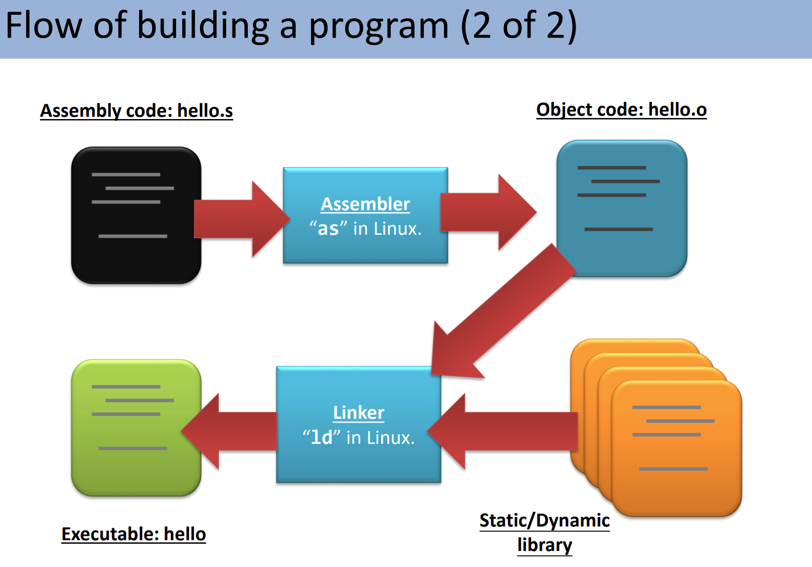

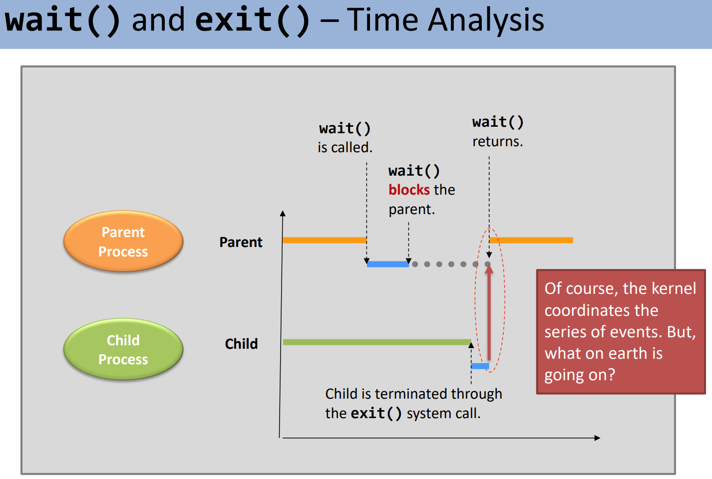

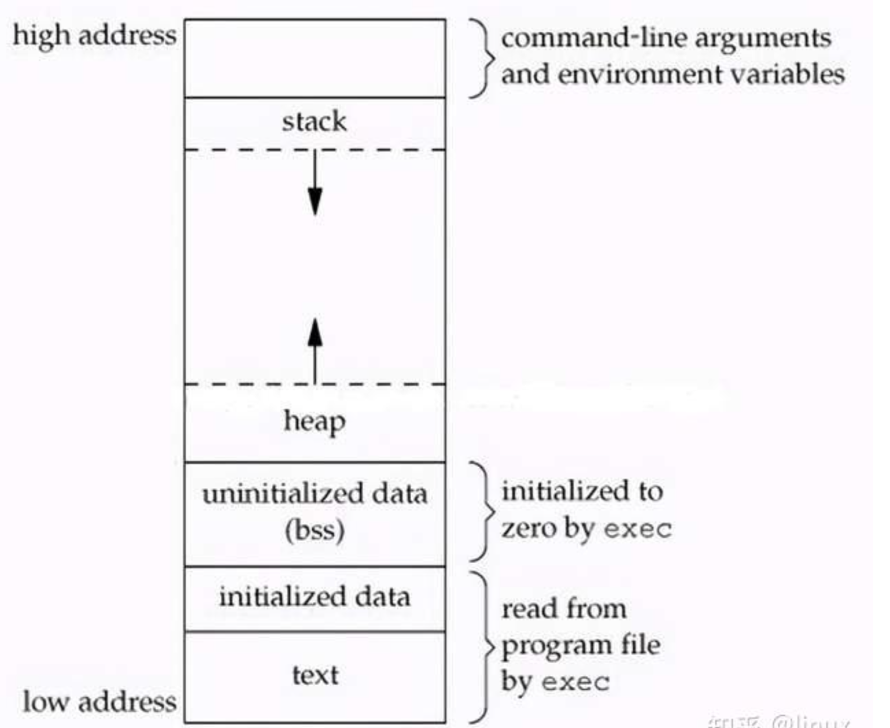

</figure>

**child side --- exit()**

**1. 进程终止初期的资源回收**

当子进程调用 `exit()` 后，内核会立即执行以下清理工作：

- **释放用户空间内存：** 删除该进程在用户空间的所有内容，包括程序代码、全局变量、局部变量以及动态分配的堆内存。

- **关闭文件描述符：** 内核会自动关闭进程打开的所有文件（这就是为什么即便没手动调用 `fclose()`，内核也能保证安全回收）。

- **保留最小内核项：** 虽然用户空间资源被清空，但内核仍会在内核空间保留该进程的 **PCB（进程控制块）** 信息。

**2. 僵尸进程（Zombie Process）的产生**

进程在调用 `exit()` 后并不会立即从进程表中完全消失，而是进入“终止状态”：

- **定义：** 此时的进程被称为**僵尸进程**。

- **保留内容：** 仅在内核中保留最少量的存储信息，主要是 **PID** 和 **进程状态/退出码**。

- **存在意义：** 它是为了让父进程能够通过 `wait()` 等系统调用获取子进程的退出状态。

- **所有权：** 此时 PID 和基础进程结构仍然被该子进程“占用”，直到父进程处理它。

**3. 父子进程间的通信：信号机制**

为了通知父进程子进程已经结束，内核采用了信号机制：

- **SIGCHLD 信号：** 当子进程终止时，内核会向其父进程发送一个名为 `SIGCHLD` 的信号。

- **唤醒父进程：** 这个信号的作用是提醒父进程去执行“收尸”工作（即调用 `wait()`），从而彻底从进程表中移除该子进程。

**4. 关于信号（Signal）的补充知识**

- **本质：** 一种**软件中断**，其处理步骤类似于硬件中断。

- **分类：**

- **用户空间生成：** 如键盘组合键 `Ctrl+C` 或调用 `kill()` 系统调用。

- **内核/CPU 生成：** 如内存访问错误（`SIGSEGV`）、除零错误（`SIGFPE`）以及子进程终止（`SIGCHLD`）。

当一个进程执行退出操作时，内核会按序完成以下任务：

- **Step (1) 清理内核空间内存**：释放大部分内核分配给该进程的资源（如打开的文件、内部缓冲区等），但会保留一小部分核心数据（主要是 PCB 中的退出状态）。

- **Step (2) 清理用户空间内存**：彻底销毁该进程的程序代码、全局变量、堆和栈。此时，进程在内存中已无任何可执行指令。

- **Step (3) 发送** `**SIGCHLD**` **信号**：这是“临终遗言”，内核代子进程向父进程发送该信号，告知其已结束。

消除僵尸进程主要有两种方式：

1. **父进程调用** `**wait()**` **或** `**waitpid()**`： 这是最正规的手段。父进程通过这些系统调用主动询问子进程的退出状态。一旦 `wait()` 返回，内核就会认为该子进程的任务已彻底完成，从而将其 PCB 从进程表中移除。

2. **“孤儿院”机制（Init/Systemd 接管）**： 如果父进程在子进程变成僵尸之前就先退出了，或者父进程死活不调用 `wait()`，那么该子进程会变成“孤儿”。此时，系统的 1 号进程（`init` 或 `systemd`）会收养它。1 号进程被设计为会不断地循环调用 `wait()`，从而确保所有僵尸进程最终都能被清理干净。

**parent side**

**1. wait() 的核心机制：阻塞与信号**

当父进程调用 `wait()` 时，它不仅仅是在“等待”，内核在底层执行了一系列复杂的动作：

- **状态转换**：父进程会被内核设置为睡眠（Sleeping）**状态，即** `**wait()**` **系统调用会**阻塞（Block）父进程的执行，直到有子进程终止。

- **设置信号处理程序**：内核会为父进程设置一个 `SIGCHLD` 的信号处理例程（Signal Handling Routine）。默认情况下进程是不响应 `SIGCHLD` 的，只有在调用 `wait()` 后才会激活这一处理逻辑。

---

**2. “收尸”过程详解（Reaping Process）**

当子进程以“僵尸”身份发送 `SIGCHLD` 信号时，会触发以下链式反应：

1. **唤醒与响应**：信号到达父进程，触发信号处理函数。

2. **默认处理逻辑**：

- 接收并移除该 `SIGCHLD` 信号。

- 彻底销毁（Destroy）发送信号的子进程。此时，子进程的 PID 和 PCB 才会真正从内核进程表中消失。

4. **返回用户态**：信号处理完成后，`wait()` 系统调用成功返回。

- **返回值**：`wait()` 的返回值是那个刚刚被清理掉的**子进程的 PID**。

### 1. `wait()` 的函数原型

在 C 语言中，`wait()` 的定义如下： `pid_t wait(int *status);`

- **参数** `**status**`：这是一个指向整数的指针。内核会将子进程的退出信息写入这个整数中。

- **返回值**：成功时返回被清理子进程的 **PID**；如果没有子进程或出错，则返回 -1。

### 2. 解析退出状态：宏（Macros）工具箱

由于 `status` 整数中包含了多种信息（如正常退出、被信号终止等），不能直接读取，必须使用系统提供的**宏**来解析：

- `**WIFEXITED(status)**`：如果子进程是**正常退出**（即调用了 `exit()` 或从 `main` 返回），该宏返回真。

- `**WEXITSTATUS(status)**`：只有在 `WIFEXITED` 为真时使用。它能提取出子进程传递给 `exit(n)` 的那个**具体数值** `**n**`（通常只取低 8 位，范围 0-255）。
