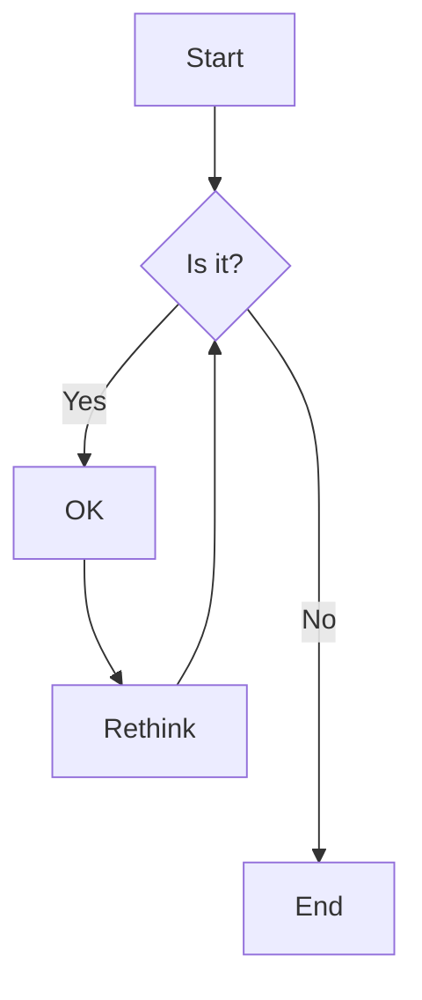



下面是标题与排版示例。Markdown 中用 `#` 表示一级标题，`######` 表示六级标题。

# 一级标题

## 二级标题

### 三级标题

#### 四级标题

##### 五级标题

###### 六级标题

---

### 强调

斜体可用 *星号* 或 _下划线_。

加粗用 **星号** 或 __下划线__。

**组合：加粗里嵌 _斜体_**。

删除线用双波浪线：~~划掉这段~~。

---

### 按钮



---

### 链接

[内联样式链接](https://www.google.com)

[带标题的内联链接](https://www.google.com "Google 首页")

[相对路径示例](/blog/)


尖括号内的网址会被自动转为链接。
<http://www.example.com> 或 <http://www.example.com>
下面可演示引用式链接等写法。

---

### 段落

这是一段示例正文，用来观察段落与行距效果。写博客时替换为你的中文内容即可。

---

### 有序列表

1. 列表项
2. 列表项
3. 列表项
4. 列表项
5. 列表项

---

### 无序列表

- 列表项
- 列表项
- 列表项
- 列表项
- 列表项

---

### 提示块


这是一条 note 提示。



这是一条 quote 引用块。



这是一条 tip 提示。



这是一条 info 信息。



这是一条 warning 警告。


---

### 标签页




#### 标签页里的标题

标签页中的正文区域，可写任意 Markdown。





#### 第二个标签

同样可以放置正文与组件。





#### 第三个标签

用于演示多个标签页的切换效果。




---

### 手风琴



- 可折叠内容，节省版面
- 适合 FAQ 或补充说明
- 与正文风格一致即可





- 优先用 Flex / Grid 布局
- 避免过多负边距造成错位
- 具体代码视你的主题而定





- 仅在明确知道布局后果时使用
- 可能影响可访问性与响应式表现
- 优先考虑内边距与间距工具类



---

### 代码与高亮

这是一段行内代码示例：`const x = 1`。

```javascript
var s = "JavaScript syntax highlighting";
alert(s);
```

```python
s = "Python syntax highlighting"
print s
```

```c  { linenos=true }
#include <stdio.h>

int main(void)
{
    printf("hello, world\n");
    return 0;
}
```



---

### 引用

> 这是一段引用示例。可把书摘、对话或需要强调的他人观点放在这里。

---

### 表格

| 表格示例   |    对齐方式   | 数值 |
| ---------- | :-----------: | ---: |
| 第三列示例 |    右对齐     | 1600 |
| 第二列示例 |    居中       |   12 |
| 斑马纹示例 |    左对齐习惯 |    1 |

---

### 图片



---

### 图片画廊



---

### 轮播图



---

### YouTube 视频



---

### 自定义视频


